# MS Product Catalog

Microsserviço de **Catálogo de Produtos** desenvolvido com **Clean Architecture**, **DDD**, **Hexagonal Architecture**,
**SOLID** e os Padrões
**CQS (Command Query Separation)** e **CQRS (Command Query Responsibility Segregation)**.

✨ **Foco**: Separação estrita de responsabilidades, inversão de dependência e domínio desacoplado da infraestrutura.

## 👨‍💻 Desenvolvido por Humano + IA

[](https://gemini.google.com/)
[](https://www.perplexity.ai/)
[](https://anthropic.com/claude)

> **Feito com muito café** ☕ **+ conhecimento humano** 🧠 **e auxílio de IAs** para ideias, pesquisas e refinamentos
> rápidos.

---

## 📊 Quality & Security

[](https://sonarcloud.io/summary/new_code?id=wallanpsantos_ms-product-catalog)
[](https://sonarcloud.io/summary/new_code?id=wallanpsantos_ms-product-catalog)
[](https://sonarcloud.io/summary/new_code?id=wallanpsantos_ms-product-catalog)
[](https://sonarcloud.io/summary/new_code?id=wallanpsantos_ms-product-catalog)
[](https://sonarcloud.io/summary/new_code?id=wallanpsantos_ms-product-catalog)
[](https://sonarcloud.io/summary/new_code?id=wallanpsantos_ms-product-catalog)
[](https://sonarcloud.io/summary/new_code?id=wallanpsantos_ms-product-catalog)

[//]: # ([![Technical Debt]&#40;https://sonarcloud.io/api/project_badges/measure?project=wallanpsantos_ms-product-catalog&metric=sqale_index&#41;]&#40;https://sonarcloud.io/summary/new_code?id=wallanpsantos_ms-product-catalog&#41;)

## 🔄 CI/CD

[](https://github.com/wallanpsantos/ms-product-catalog/actions/workflows/build-and-test.yml)
[](https://openjdk.org/projects/jdk/21/)
[](https://spring.io/projects/spring-boot)
[](https://www.mongodb.com/)
[](https://www.graalvm.org/)
[](https://docs.docker.com/compose/)
[](https://gradle.org/)
[](LICENSE)

---

## 📖 Sobre o Projeto

O `ms-product-catalog` é um microsserviço de catálogo de produtos que implementa:

- **Arquitetura Hexagonal (Ports & Adapters):** isolamento total entre o núcleo de negócio e os detalhes de
  infraestrutura.
- **Domain-Driven Design (DDD):** Aggregate Root, Value Objects, Domain Services e Notification Pattern.
- **CQRS com Domain Bypass:** separação física de adaptadores de leitura e escrita, com o lado de leitura ignorando
  completamente as entidades de domínio ricas (bypass direto para DTOs).
- **CQS no nível de código:** todos os métodos de comando retornam `void` ou apenas identificadores; nunca retornam
  dados de leitura.
- **GraalVM Native Image:** compilação AOT para startup ultrarrápido (~50–200ms) e footprint de memória mínimo.

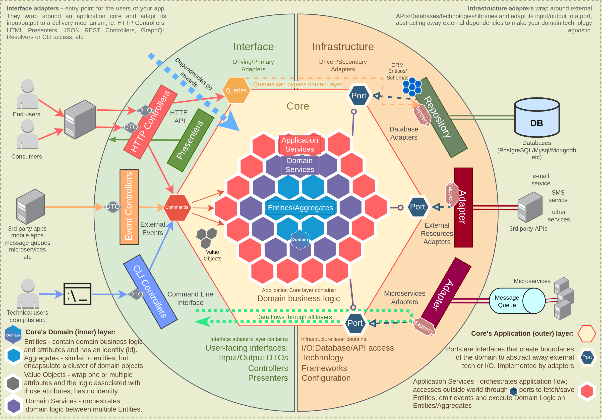
> *Fonte da Imagem: [Domain-Driven Hexagon](https://github.com/Sairyss/domain-driven-hexagon)*

---

## 🚀 Tecnologias

| Categoria             | Tecnologia                       | Versão mínima               |
|-----------------------|----------------------------------|-----------------------------|
| Linguagem             | Java                             | 21                          |
| Framework             | Spring Boot                      | 4.0.3                       |
| Banco de Dados        | MongoDB                          | 8.0.11                      |
| Compilação Nativa     | GraalVM Native Image             | 21.0.2                      |
| Resiliência           | Resilience4j (Circuit Breaker)   | 2025.1.0 (via Spring Cloud) |
| Documentação API      | SpringDoc OpenAPI 3 (Swagger UI) | 3.0.1                       |
| Análise de Qualidade  | SonarQube Cloud                  | —                           |
| Testes Unitários      | JUnit + AssertJ + Mockito        | via Spring Boot + 3.27.7    |
| Testes de Integração  | Testcontainers (MongoDB)         | via Spring Boot             |
| Testes de API Externa | Contract Stub Runner (WireMock)  | 2025.1.0 (via Spring Cloud) |
| Testes E2E            | REST Assured                     | 6.0.0                       |
| Testes de Arquitetura | ArchUnit                         | 1.4.1                       |
| Cobertura de Código   | JaCoCo                           | via Gradle                  |
| Build                 | Gradle (Kotlin DSL)              | 9.3.1                       |

---

## 🛠️ Instalação e Execução

### Pré-requisitos

* JDK 21 instalado.
* Docker e Docker Compose **ou** Podman instalados no ambiente local.

### Passos para rodar localmente

**1. Clone o repositório:**

```bash
git clone https://github.com/wallanpsantos/ms-product-catalog.git
cd ms-product-catalog
```

**2. Configure as variáveis de ambiente:**

Crie um arquivo `.env` na raiz do projeto (já listado no `.gitignore`):

```bash
cp .env.example .env  # ou crie manualmente
```

```env
MONGO_ROOT_USERNAME=admin
MONGO_ROOT_PASSWORD=change-me-in-production
MONGO_DB_NAME=db-product-catalog
MONGO_EXPRESS_USER=admin
MONGO_EXPRESS_PASSWORD=change-me-in-production
```

**3. Suba a infraestrutura (MongoDB + Mongo Express):**

Com Docker:

```bash
docker compose up -d
```

Com Podman:

```bash
podman compose up -d
```

**4. Compile e execute a aplicação:**

```bash
./gradlew bootRun
```

Ou compile o JAR e execute:

```bash
./gradlew clean build -x nativeCompile
java -jar build/libs/ms-product-catalog-1.0.0.jar
```

### Compilação Nativa (GraalVM)

Para compilar o executável nativo com startup ultrarrápido:

```bash
./gradlew nativeCompile
./build/native/nativeCompile/ms-product-catalog
```

> **Nota:** A compilação nativa pode levar alguns minutos. Em CI, o passo `nativeCompile` é ignorado com
`-x nativeCompile` para agilizar o pipeline.

---

## 🧪 Testes

Execute todos os testes (unitários + integração via Testcontainers):

```bash
./gradlew test
```

O relatório de cobertura JaCoCo é gerado automaticamente em `build/reports/jacoco/test/`.

Execute apenas testes de arquitetura:

```bash
./gradlew test --tests "*ArchTest*"
```

---

## 📖 Documentação da API

Após iniciar a aplicação, acesse:

| Interface     | URL                                                                            |
|---------------|--------------------------------------------------------------------------------|
| Swagger UI    | [http://localhost:8080/swagger-ui.html](http://localhost:8080/swagger-ui.html) |
| OpenAPI JSON  | [http://localhost:8080/v3/api-docs](http://localhost:8080/v3/api-docs)         |
| Health Check  | [http://localhost:8080/actuator/health](http://localhost:8080/actuator/health) |
| Mongo Express | [http://localhost:8081](http://localhost:8081)                                 |

---

## 🧭 Exemplos de Uso (cURL)

Um script completo com exemplos de chamadas para todos os endpoints está disponível em [
`docs/curl-examples.sh`](docs/curl-examples.sh).

### Criar um Produto

```bash
curl -X POST http://localhost:8080/api/v1/products \
  -H "Content-Type: application/json" \
  -d '{
    "name": "Smartphone Galaxy S24",
    "description": "256GB, Titanium Gray",
    "category": "Eletronicos",
    "brand": "Samsung",
    "price": 5999.00,
    "active": true
  }'
```

### Buscar por ID

```bash
curl http://localhost:8080/api/v1/products/{id}
```

### Listar Produtos Ativos (com paginação)

```bash
curl "http://localhost:8080/api/v1/products?page=0&perPage=10&sort=name&dir=asc"
```

### Pesquisar Produtos

```bash
curl -X POST http://localhost:8080/api/v1/products/search \
  -H "Content-Type: application/json" \
  -d '{ "query": "samsung" }'
```

### Criar em Lote

```bash
curl -X POST http://localhost:8080/api/v1/products/batch \
  -H "Content-Type: application/json" \
  -d '[
    { "name": "Produto A", "description": "Desc A", "category": "Cat", "brand": "Brand", "price": 100.0, "active": true },
    { "name": "Produto B", "description": "Desc B", "category": "Cat", "brand": "Brand", "price": 200.0, "active": true }
  ]'
```

### Desativar (Soft Delete)

```bash
curl -X DELETE http://localhost:8080/api/v1/products/{id}
# HTTP 204 No Content
```

---

## 🏛️ Arquitetura

### Visão Geral — CQRS com Domain Bypass

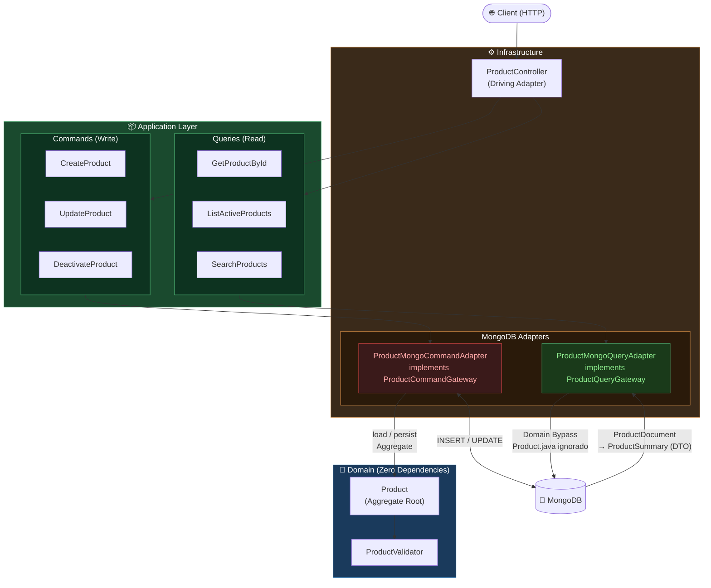

### Fluxo de Leitura — Domain Bypass Total

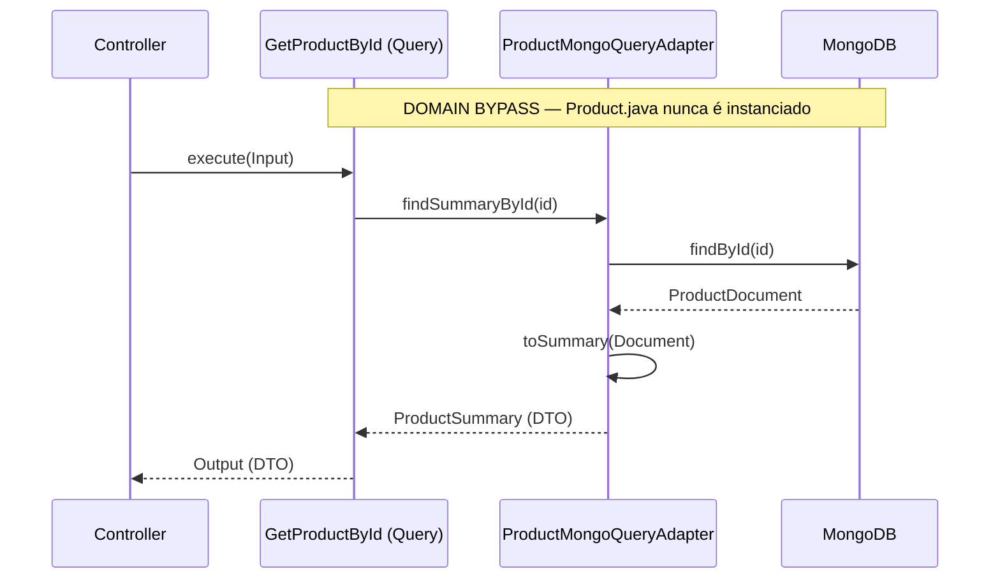

### Fluxo de Escrita — Agregado Rico

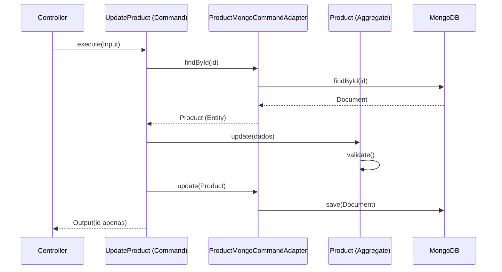

---

## 📊 Sequence Diagrams por Endpoint

<details>
<summary>POST /api/v1/products — Criar Produto</summary>

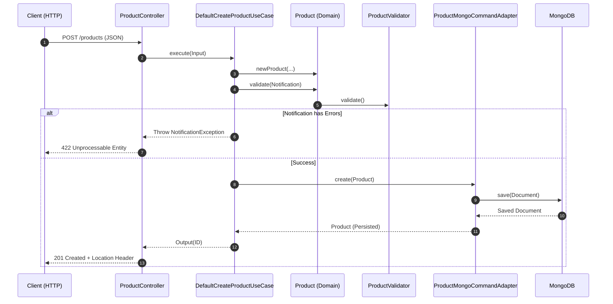

</details>

<details>
<summary>POST /api/v1/products/batch — Criar em Lote</summary>

```mermaid
sequenceDiagram
    autonumber
    participant C as Client
    participant CTRL as Controller
    participant UC as BatchUseCase
    participant DOM as Product
    participant GW as Gateway
    participant DB as MongoDB
    C ->> CTRL: POST /batch (List<Request>)
    CTRL ->> UC: execute(List<Input>)
    loop For each Item
        UC ->> DOM: newProduct(...)
        UC ->> DOM: validate()
        opt Error
            UC -->> CTRL: Throw NotificationException
        end
    end
    UC ->> GW: createAll(List<Product>)
    GW ->> DB: saveAll(List<Document>)
    DB -->> GW: Saved Documents
    GW -->> UC: List<Product>
    UC -->> CTRL: List<Output>
    CTRL -->> C: 201 Created (List<Response>)
```

</details>

<details>
<summary>GET /api/v1/products/{id} — Busca por ID</summary>

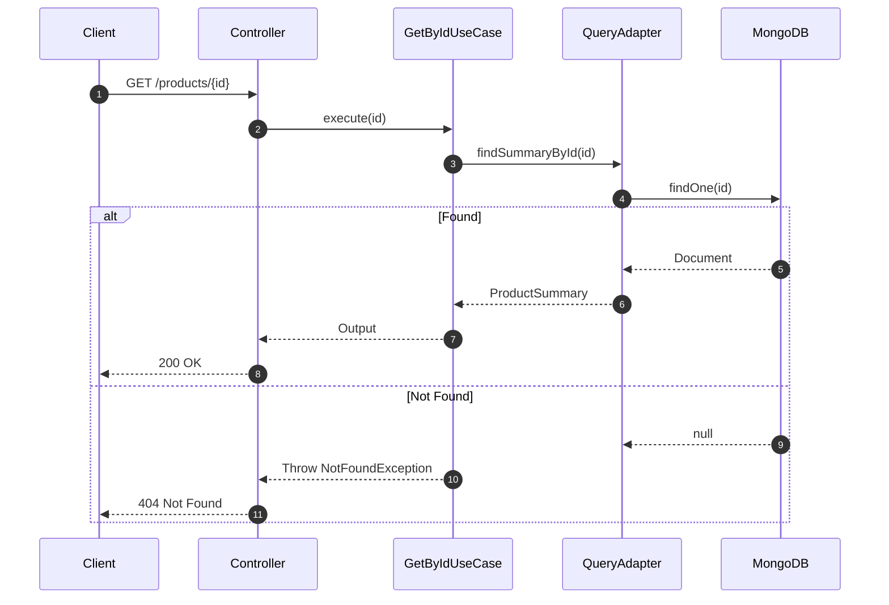

</details>

<details>
<summary>GET /api/v1/products — Listagem Paginada</summary>

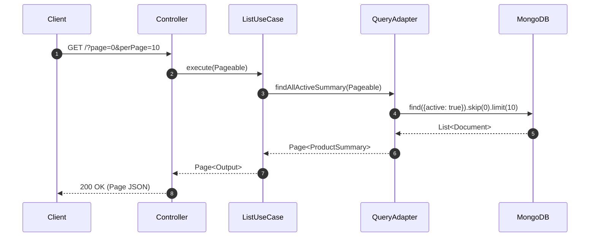

</details>

<details>
<summary>PUT /api/v1/products/{id} — Atualizar Produto</summary>

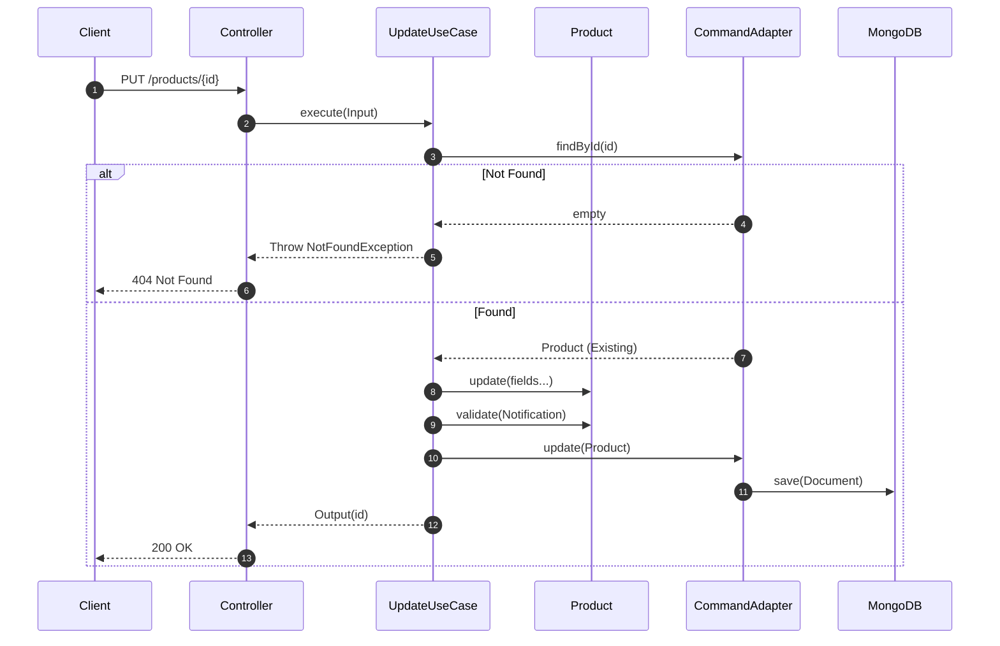

</details>

<details>
<summary>PUT /api/v1/products/batch — Atualizar em Lote (Bulk Read Anti N+1)</summary>

```mermaid
sequenceDiagram
    autonumber
    participant C as Client
    participant CTRL as Controller
    participant UC as BatchUpdateUC
    participant GW as CommandAdapter
    participant DB as MongoDB
    C ->> CTRL: PUT /batch (List<UpdateReq>)
    CTRL ->> UC: execute(List<Input>)
    Note right of UC: 1. Busca em Massa (evita N+1)
    UC ->> GW: findAllById(ids)
    GW ->> DB: find({_id: {$in: ids}})
    DB -->> GW: List<Documents>
    Note right of UC: 2. Processamento em Memória
    alt Missing IDs
        UC -->> CTRL: Throw NotFoundException
    else All Found
        UC ->> UC: Update & Validate (Loop)
        UC ->> GW: updateAll(List<Product>)
        GW ->> DB: saveAll(Documents)
        GW -->> UC: List<Product>
        UC -->> CTRL: List<Output>
        CTRL -->> C: 200 OK
    end
```

</details>

<details>
<summary>DELETE /api/v1/products/{id} — Desativar (Soft Delete)</summary>

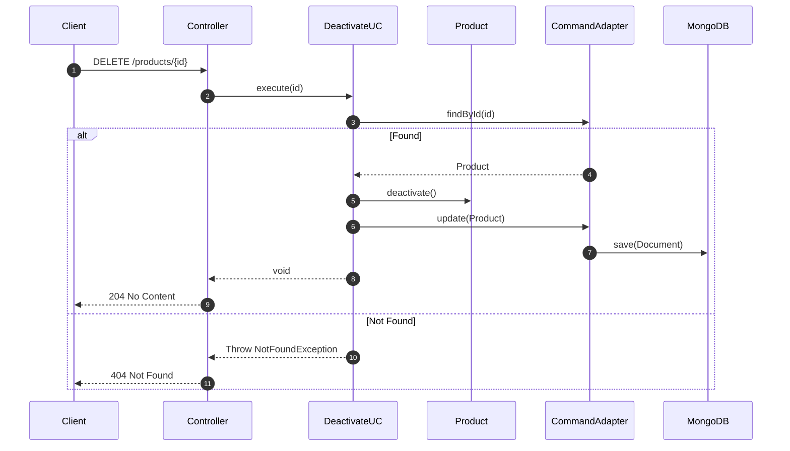

</details>

<details>
<summary>POST /api/v1/products/search — Pesquisa Textual</summary>

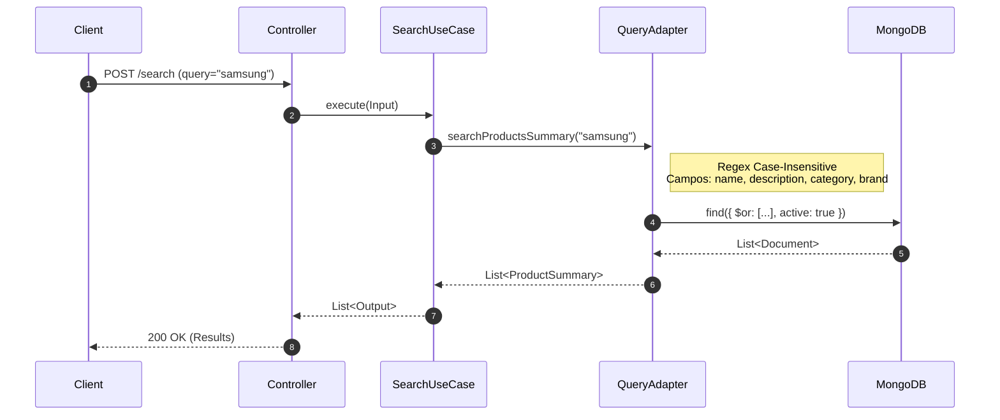

</details>

---

## 🔒 Segurança & DevSecOps

- **SonarQube Cloud:** análise contínua de vulnerabilidades, bugs e code smells em cada push.
- **Dependabot:** monitoramento automático do grafo de dependências via GitHub Dependency Graph.
- **Gradle Wrapper Validation:** o checksum do `gradle-wrapper.jar` é validado contra o registro oficial do Gradle antes
  de qualquer compilação no CI, prevenindo ataques à cadeia de suprimento.
- **Imagem Docker não-root:** o container executa com usuário `appuser` (sem privilégios de root).
- **Secrets via variáveis de ambiente:** credenciais nunca são hardcoded; gerenciadas por `.env` (gitignored) ou um
  secrets manager em produção.
- **`no-new-privileges`:** opção Docker que impede que processos internos ao container adquiram privilégios adicionais
  pós-startup.

---

## 📂 Documentação Adicional

| Documento                                                   | Descrição                                            |
|-------------------------------------------------------------|------------------------------------------------------|
| [Estrutura do Projeto](docs/PROJECT_STRUCTURE.md)           | Detalhamento de cada camada e decisões arquiteturais |
| [Padrões CQS & CQRS](docs/referencias/PATTERNS_CQS_CQRS.md) | Guia de arquitetura com exemplos e diagramas         |
| [curl-examples.sh](docs/curl-examples.sh)                   | Scripts prontos para testar todos os endpoints       |

---

## 📄 Licença

Veja [`LICENSE`](LICENSE) para mais informações.