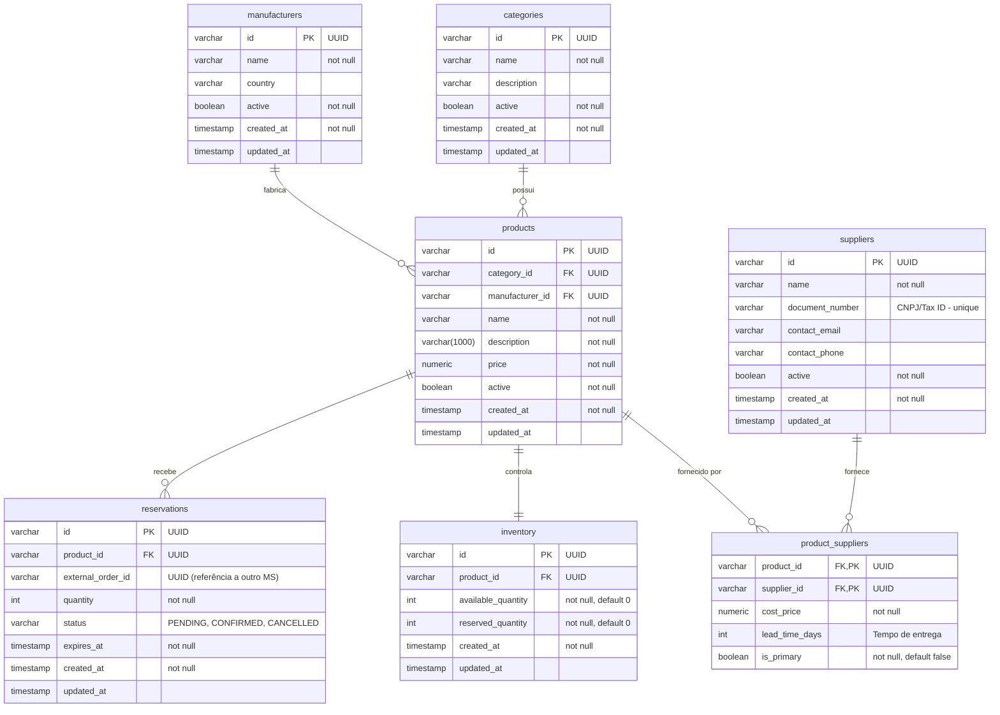

# Modelagem de Dados - Catálogo de Produtos

Este documento descreve a estrutura de dados do microsserviço de Catálogo de Produtos (`ms-product-catalog`), englobando desde a vitrine básica até o controle de estoque e aquisição.

## Diagrama Entidade-Relacionamento (ER)

## Dicionário de Dados e Responsabilidades

A modelagem foi pensada para dividir claramente as responsabilidades de negócio do domínio. Abaixo detalhamos o papel de cada tabela:

### 1. `categories` (O que tipo é?)
Gerencia a taxonomia dos produtos (ex: "Smartphone", "Notebook", "Eletrodomésticos").
* Separar as categorias em uma tabela própria garante a integridade dos dados (evita erros de digitação de categorias repetidas) e permite futuras expansões, como criar subcategorias ou adicionar imagens e metadados para a vitrine.

### 2. `manufacturers` (Quem faz/fabrica?)
Representa a marca ou a empresa que fabrica o produto (ex: "Apple", "Samsung", "LG").
* Substitui um simples campo de texto de `brand`. Isso permite associar o produto à origem real da marca, possibilitando filtros exatos na loja (ex: "Buscar todos os produtos da Apple").

### 3. `products` (O que é e por quanto eu vendo?)
É o coração do catálogo. Representa o item que o cliente final enxerga na vitrine da loja.
* Guarda o preço de venda final (`price`), nome, descrição e os vínculos de `category_id` e `manufacturer_id`.

### 4. `suppliers` e `product_suppliers` (De quem eu compro e quanto me custa?)
Responsáveis por gerenciar a **aquisição** dos produtos para a loja.
* **`suppliers` (Fornecedores)**: Representa as empresas distribuidoras (ex: "Distribuidora de Eletrônicos XYZ"). Armazena os dados de contato e CNPJ.
* **`product_suppliers` (Tabela Associativa N:M)**: Um produto ("iPhone 15") pode ser comprado de vários fornecedores diferentes. Esta tabela guarda os metadados dessa relação para *cada* fornecedor específico:
  * `cost_price`: O preço de custo (quanto a sua loja paga para aquele fornecedor).
  * `lead_time_days`: Quantos dias o fornecedor demora para entregar a mercadoria.
  * `is_primary`: Define se este é o fornecedor padrão/principal de quem a loja costuma comprar quando o estoque abaixa.

### 5. `inventory` (Quantos eu tenho fisicamente?)
Controla a quantidade de produtos no armazém.
* Possui relação `1:1` com produtos no cenário atual.
* **`available_quantity`**: Quantos itens físicos estão livres na prateleira prontos para serem vendidos.
* **`reserved_quantity`**: Quantos itens físicos existem na prateleira, mas já estão no carrinho de alguém aguardando pagamento. Isso evita a "venda casada" do mesmo item para duas pessoas.

### 6. `reservations` (Quantos estão separados em carrinhos/pedidos?)
Trata do fluxo temporal entre o cliente colocar no carrinho/finalizar checkout e o pagamento ser efetivamente aprovado.
* **`external_order_id`**: O ID do pedido gerado por outro microsserviço (ex: Microsserviço de Pedidos/Checkout).
* **`status`**: PENDING (aguardando pagamento), CONFIRMED (pago - a reserva é efetivada e baixada do estoque) ou CANCELLED (não pagou).
* **`expires_at`**: Essencial! Se o cliente gerar um boleto e não pagar em 48h, a reserva expira, a quantidade volta de `reserved_quantity` para `available_quantity` na tabela de `inventory`, e o item volta a ficar disponível na vitrine.
