# Guia Interativo: Fluxo de Atualização em Lote (Batch Update)

Este guia detalha o fluxo otimizado de atualização de múltiplos produtos, demonstrando como evitar problemas de performance comuns (N+1 queries) em operações de lote.

---

## 1. O Desafio do "N+1" em Lotes
Em uma abordagem ingênua, atualizar 100 produtos significaria:
1.  Iterar sobre a lista de entrada.
2.  Para cada item, ir ao banco buscar o produto (`findById` -> 100 queries).
3.  Atualizar e salvar (`save` -> +100 operações ou 1 batch).

Isso resulta em **alta latência de rede**, pois o sistema fica indo e voltando ao banco de dados repetidamente.

---

## 2. A Solução: Bulk Read & In-Memory Processing
No `DefaultUpdateProductBatchUseCase`, implementamos a seguinte estratégia:

1.  **Bulk Read (Leitura em Massa):** Coletamos todos os IDs da requisição e fazemos **uma única consulta** ao banco (`findAllById`) para trazer todos os dados necessários para a memória.
2.  **Validação de Existência:** Verificamos se a quantidade de produtos retornados bate com a quantidade solicitada. Se faltar algum, abortamos a operação (Atomicidade Lógica).
3.  **Processamento em Memória:** Criamos um Mapa (`Map<ID, Product>`) para acessar os produtos em tempo constante O(1) enquanto iteramos sobre a entrada. A lógica de negócio (atualização e validação de domínio) roda na CPU da aplicação, que é extremamente rápida.
4.  **Bulk Write (Escrita em Massa):** Persistimos todas as alterações de uma vez (`updateAll` / `saveAll`).

**Resultado:** Redução de `O(N)` interações de rede para `O(1)`.

---

## 📊 Diagrama de Sequência (Batch Update)

```mermaid
sequenceDiagram
    autonumber
    participant C as Client (HTTP)
    participant CTRL as ProductController
    participant MAP as RestMapper
    participant UC as BatchUseCase
    participant GW as ProductGateway
    participant DB as MongoDB

    C->>CTRL: PUT /batch (List<UpdateProductRequest>)
    
    activate CTRL
    CTRL->>MAP: toUpdateInput(List)
    MAP-->>CTRL: List<UseCase.Input>
    
    CTRL->>UC: execute(List<Input>)
    activate UC
    
    Note right of UC: 1. Extração de IDs
    UC->>UC: ids = inputs.map(id)
    
    Note right of UC: 2. Bulk Read (Otimização)
    UC->>GW: findAllById(ids)
    activate GW
    GW->>DB: find({_id: {$in: ids}})
    DB-->>GW: List<ProductDocument>
    GW-->>UC: List<Product> (Existing)
    deactivate GW
    
    Note right of UC: 3. Validação de Integridade
    alt Size Mismatch (Missing IDs)
        UC-->>CTRL: Throw NotFoundException (List of missing IDs)
        CTRL-->>C: 404 Not Found
    end
    
    Note right of UC: 4. Processamento In-Memory
    UC->>UC: Map<ID, Product> = existing.toMap()
    
    loop For each Input
        UC->>UC: product = map.get(input.id)
        UC->>UC: product.update(...)
        UC->>UC: product.validate(notification)
    end
    
    alt Notification has Errors
        UC-->>CTRL: Throw NotificationException
        CTRL-->>C: 422 Unprocessable Entity
    else Success
        Note right of UC: 5. Bulk Write
        UC->>GW: updateAll(List<Product>)
        activate GW
        GW->>DB: saveAll(documents)
        DB-->>GW: Saved Documents
        GW-->>UC: List<Product> (Updated)
        deactivate GW
        
        UC-->>CTRL: List<Output>
        deactivate UC
        
        CTRL-->>C: 200 OK (List<ProductResponse>)
    end
    deactivate CTRL
```

---

## 3. Resumo Técnico

*   **Entrada:** `List<UpdateProductRequest>` (contém ID e dados).
*   **Camada de Aplicação:** `DefaultUpdateProductBatchUseCase`.
*   **Complexidade de Rede:** O(1) (constante, independente do tamanho do lote).
*   **Complexidade de CPU:** O(N) (linear, para processar a lista em memória).
*   **Transacionalidade:** No MongoDB (sem Replica Set configurado), o `saveAll` pode não ser atômico por padrão (se falhar no meio, alguns salvam, outros não). Para garantir atomicidade total ("Tudo ou Nada"), é necessário habilitar Transações Multi-Documento no MongoDB Cluster. A lógica de aplicação garante "Tudo ou Nada" na etapa de **validação** (antes de salvar), mas erros de banco (ex: disco cheio no meio do batch) podem gerar estado parcial.
