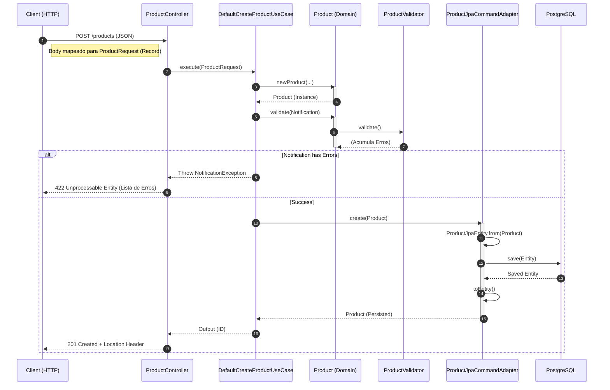

# Guia Interativo: O Ciclo de Vida de um POST

Este guia detalha o caminho de uma requisição de criação de produto, explicando os conceitos de Engenharia de Software aplicados em cada etapa, com base na arquitetura do `ms-product-catalog`.

---

## 1. O Ponto de Partida: Injeção de Dependências
**Onde:** `infrastructure.config.UseCaseConfig`

Antes da primeira requisição chegar, o sistema prepara o terreno usando **Inversão de Controle (IoC)**.

*   **A Teoria (Hexagonal Architecture - The "Glue"):** A camada de Aplicação (Use Cases) é puramente Java, sem anotações de framework (`@Service`, `@Component`). Quem faz a ponte é uma classe de configuração na camada de Infraestrutura.
*   **A Prática (`UseCaseConfig.java`):**
    ```java
    @Configuration
    public class UseCaseConfig {
        @Bean
        // O Spring injeta o Adapter de Saída (ProductGateway)
        public CreateProductUseCase createProductUseCase(final ProductGateway gateway) {
            // Retorna a implementação concreta do Caso de Uso, passando a dependência
            return new DefaultCreateProductUseCase(gateway);
        }
    }
    ```

---

## 2. A Chegada do Dado: Records como Input
**Onde:** `infrastructure.adapter.input.rest.controller.ProductController` e `dto.request.ProductRequest`

*   **A Teoria (Imutabilidade e Tipagem Forte):** Em vez de DTOs mutáveis cheios de getters/setters, usamos **Records** (Java 14+). O DTO de entrada (`ProductRequest`) implementa diretamente a interface de entrada do Caso de Uso (`CreateProductUseCase.Input`). Isso cria um acoplamento intencional para eliminar a necessidade de um mapper redundante na entrada.
*   **A Prática:**
    *   **Interface do Use Case:**
        ```java
        public abstract class CreateProductUseCase extends UseCase<CreateProductUseCase.Input, CreateProductUseCase.Output> {
            public interface Input {
                String name();
                BigDecimal price();
                // ... outros campos
            }
        }
        ```
    *   **DTO (Infrastructure):**
        ```java
        public record ProductRequest(
            @NotBlank String name,
            @Positive BigDecimal price
            // ...
        ) implements CreateProductUseCase.Input { }
        ```
    *   **Controller:**
        ```java
        @PostMapping
        public ResponseEntity<CreateProductResponse> createProduct(@RequestBody @Valid final ProductRequest input) {
            // O controller recebe o DTO que JÁ É um Input válido para o Use Case
            final var output = createProductUseCase.execute(input);
            return ResponseEntity.created(URI.create("/products/" + output.id())).body(new CreateProductResponse(output.id()));
        }
        ```

---

## 3. A Execução: Command Pattern
**Onde:** `application.usecase.DefaultCreateProductUseCase`

*   **A Teoria (Command Pattern):** Cada Caso de Uso é um comando isolado com uma única responsabilidade pública: `execute`. Ele orquestra o fluxo, mas não contém regras de negócio "core" (como validação de tamanho de nome), delegando isso ao Domínio.
*   **A Prática:**
    ```java
    @Override
    public Output execute(final Input input) {
        // 1. Cria a entidade (Factory Method)
        final var notification = Notification.create();
        final var product = Product.newProduct(input.name(), input.description(), ...);
        
        // 2. Valida (Notification Pattern)
        product.validate(notification);
        
        // 3. Verifica Erros
        if (notification.hasError()) {
            throw NotificationException.with("Could not create Aggregate Product", notification);
        }
        
        // 4. Persiste (Gateway)
        return create(product);
    }
    
    private Output create(final Product product) {
        return new StdOutput(this.productGateway.create(product).getId().getValue());
    }
    ```

---

## 4. O Domínio: Notification Pattern
**Onde:** `domain.product.Product` e `domain.product.ProductValidator`

*   **A Teoria (Notification vs. Fail-Fast):**
    *   **Fail-Fast (Exceções):** Para execução no primeiro erro (ex: argumento nulo no construtor).
    *   **Notification (Acumulador):** Permite validar **todos** os campos de uma vez. O usuário recebe uma lista completa de erros (ex: "Nome vazio" E "Preço negativo") em vez de descobrir um por um.
*   **A Prática:**
    ```java
    // Em Product.java
    public void validate(final ValidationHandler handler) {
        new ProductValidator(this, handler).validate();
    }
    
    // Em ProductValidator.java
    public void validate() {
        checkNameConstraints(); // Se falhar, adiciona erro ao handler
        checkPriceConstraints(); // Continua executando...
    }
    ```

---

## 5. Persistência: Decoupling com Gateway
**Onde:** `infrastructure.adapter.output.gateway.ProductJpaCommandAdapter`

*   **A Teoria (Inversão de Dependência):** O Caso de Uso depende de uma interface (`ProductGateway`). A implementação (`ProductJpaCommandAdapter`) reside na infraestrutura. O adaptador converte o objeto de Domínio (`Product`) para o objeto de Persistência (`ProductJpaEntity`).
*   **A Prática:**
    ```java
    @Component
    public class ProductJpaCommandAdapter implements ProductGateway {
        @Override
        public Product create(final Product product) {
            // Converte Domínio -> Entidade JPA
            final var document = ProductJpaEntity.from(product);
            
            // Salva no Banco
            final var saved = this.repository.save(document);
            
            // Converte Entidade JPA -> Domínio
            return saved.toEntity();
        }
    }
    ```

---

## 6. Resposta: O Caminho de Volta
**Onde:** `GlobalExceptionHandler` e `CreateProductResponse`

*   **Sucesso (HTTP 201):** O `DefaultCreateProductUseCase` retorna um `Output` contendo apenas o ID. O Controller embrulha isso em um `CreateProductResponse` (record).
*   **Erro de Validação (HTTP 422):** Se `NotificationException` for lançada, o `GlobalExceptionHandler` a captura. Ele extrai a lista de erros do objeto `Notification` e retorna um JSON estruturado com todos os problemas encontrados.

---

## 📊 Visão Geral do Fluxo (Sequence Diagram)


