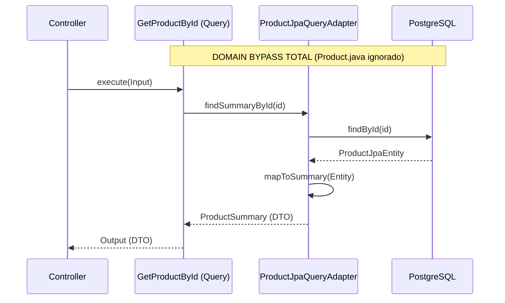
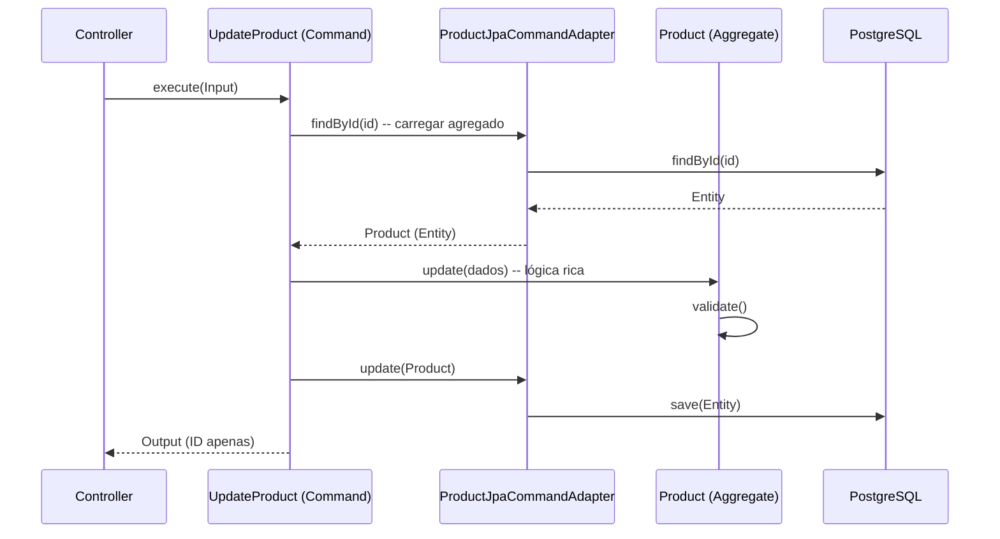

# CQS & CQRS: Guia de Arquitetura (Estado da Arte)

Este documento detalha a aplicação dos padrões **CQS (Command Query Separation)** e **CQRS (Command Query Responsibility Segregation)** no microsserviço `ms-product-catalog`.

O sistema atinge o **purismo arquitetural**, garantindo separação total entre fluxos de alteração de estado e fluxos de leitura.

---

## 1. Introdução aos Conceitos

### CQS (Command Query Separation)
**Nível:** Design de Código (Micro).
**Princípio:** Um método deve ser um Comando (ação) ou uma Consulta (pergunta), nunca ambos.
*   **Command:** Altera o estado. Retorna `void` (ou o identificador do recurso).
*   **Query:** Retorna dados. É idempotente e livre de efeitos colaterais.

### CQRS (Command Query Responsibility Segregation)
**Nível:** Estrutura de Sistema (Macro).
**Princípio:** Separação física e lógica dos modelos de leitura e escrita.
*   **Write Model (Command Side):** Focado em consistência e regras de negócio complexas.
*   **Read Model (Query Side):** Focado em performance e projeções otimizadas (Domain Bypass).

---

## 2. Implementação no Projeto

### 2.1 Purismo CQS (Camada de Domínio e Aplicação)

Aplicamos o rigor do CQS para eliminar ambiguidades e efeitos colaterais inesperados.

#### No Domínio (Entidade `Product`)
Métodos de alteração de estado são estritamente imperativos.

```java
// PURISMO CQS: Métodos de comando retornam void.
public void update(String name) { 
    this.name = name; 
    this.updatedAt = LocalDateTime.now();
}

public void deactivate() { 
    this.active = false; 
    this.updatedAt = LocalDateTime.now();
}
```

#### Na Aplicação (Use Cases de Escrita)
Comandos de atualização agora retornam apenas o identificador, desacoplando totalmente a escrita da leitura.

```java
// O Output contém apenas o ID, forçando o cliente a usar uma Query se precisar dos dados.
public record Output(String id) { }
```

### 2.2 Purismo CQRS (Domain Bypass Total)

Elevamos a segregação para um nível onde o lado de leitura **nunca** toca nas entidades de domínio ricas.

#### Read Side (Query Flow)
Todas as consultas (`GetById`, `List`, `Search`) utilizam o padrão **Domain Bypass**. O Gateway de leitura trabalha exclusivamente com DTOs de projeção (`ProductSummary`).

*   **Interface:** `ProductQueryGateway` (Exclui Entidades de Domínio).
*   **Adaptador:** `ProductJpaQueryAdapter` (Mapeia DB direto para DTO).



#### Write Side (Command Flow)
O lado de escrita continua protegendo as regras de negócio através do Agregado rico.



---

## 3. Benefícios da Excelência Arquitetural

1.  **Performance Extrema:** O lado de leitura é leve e rápido, pois não carrega a complexidade de validações e estados internos do Agregado.
2.  **Escalabilidade Independente:** Podemos trocar o banco de leitura por um Elasticsearch ou Redis sem tocar em uma única regra de negócio.
3.  **SOLID & SRP:** Cada adaptador e caso de uso tem uma responsabilidade única e clara.
4.  **Testabilidade:** Commands são testados verificando mudanças de estado; Queries são testadas verificando a precisão dos dados retornados.

---

## 4. Conclusão

O `ms-product-catalog` implementa o **CQRS Físico** com **Domain Bypass Total**. Esta abordagem garante que o sistema seja robusto para consistência (Escrita) e ultra-veloz para recuperação de informações (Leitura), estando pronto para os cenários mais exigentes de microsserviços.
